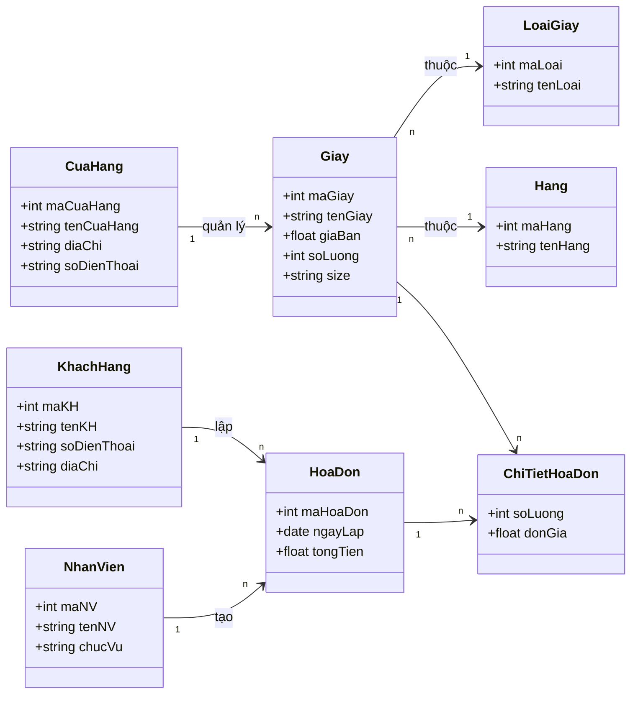

```mermaid
classDiagram
    direction LR

    class CuaHang {
        +int maCuaHang
        +string tenCuaHang
        +string diaChi
        +string soDienThoai
    }

    class Giay {
        +int maGiay
        +string tenGiay
        +float giaBan
        +int soLuong
        +string size
    }

    class LoaiGiay {
        +int maLoai
        +string tenLoai
    }

    class Hang {
        +int maHang
        +string tenHang
    }

    class KhachHang {
        +int maKH
        +string tenKH
        +string soDienThoai
        +string diaChi
    }

    class NhanVien {
        +int maNV
        +string tenNV
        +string chucVu
    }

    class HoaDon {
        +int maHoaDon
        +date ngayLap
        +float tongTien
    }

    class ChiTietHoaDon {
        +int soLuong
        +float donGia
    }

    %% Quan hệ
    CuaHang "1" --> "n" Giay : quản lý
    Giay "n" --> "1" LoaiGiay : thuộc
    Giay "n" --> "1" Hang : thuộc

    KhachHang "1" --> "n" HoaDon : lập
    NhanVien "1" --> "n" HoaDon : tạo

    HoaDon "1" --> "n" ChiTietHoaDon
    Giay "1" --> "n" ChiTietHoaDon
```
