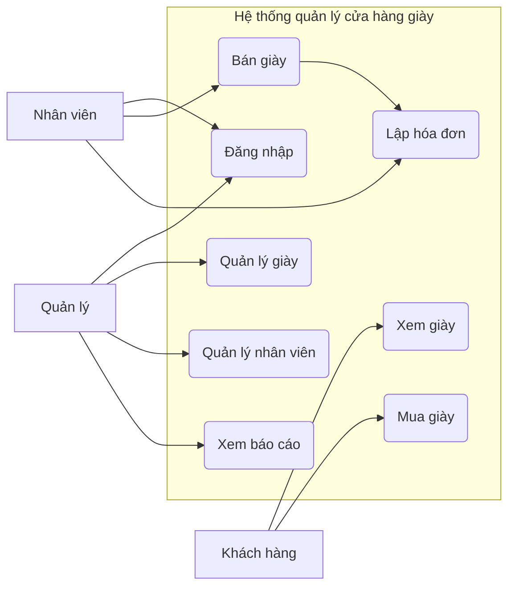

```mermaid
flowchart LR
    KH[Khách hàng]
    NV[Nhân viên]
    QL[Quản lý]

    subgraph HT[Hệ thống quản lý cửa hàng giày]
        UC1(Đăng nhập)

        UC2(Xem giày)
        UC3(Mua giày)

        UC4(Bán giày)
        UC5(Lập hóa đơn)
        UC6(Quản lý giày)
        UC7(Quản lý nhân viên)
        UC8(Xem báo cáo)
    end

    KH --> UC2
    KH --> UC3

    NV --> UC1
    NV --> UC4
    NV --> UC5

    QL --> UC1
    QL --> UC6
    QL --> UC7
    QL --> UC8


         UC4 --> UC5
```
