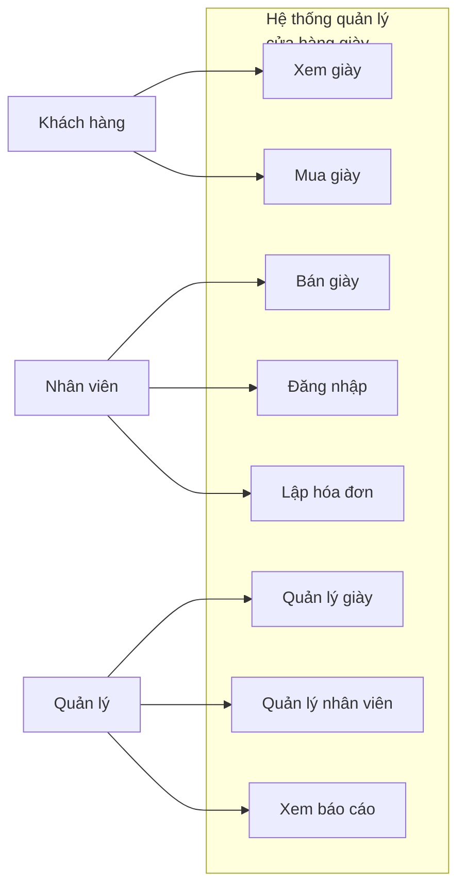

```mermaid
flowchart LR
    %% Actor
    KH[Khách hàng]
    NV[Nhân viên]
    QL[Quản lý]

    %% System
    subgraph HT["Hệ thống quản lý<br/>cửa hàng giày"]
        direction TB

        XemGiay[Xem giày]
        MuaGiay[Mua giày]

        BanGiay[Bán giày]
        DangNhap[Đăng nhập]
        LapHoaDon[Lập hóa đơn]

        QuanLyGiay[Quản lý giày]
        QuanLyNV[Quản lý nhân viên]
        XemBaoCao[Xem báo cáo]
    end

    %% Khách hàng
    KH --> XemGiay
    KH --> MuaGiay

    %% Nhân viên
    NV --> BanGiay
    NV --> DangNhap
    NV --> LapHoaDon

    %% Quản lý
    QL --> QuanLyGiay
    QL --> QuanLyNV
    QL --> XemBaoCao
```
